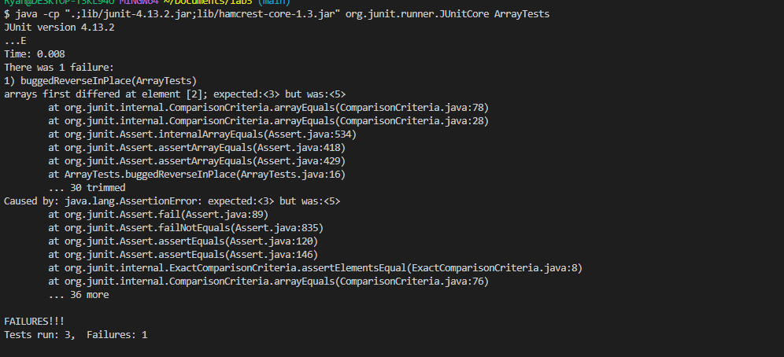
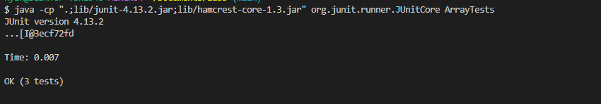

# Lab Report 3 - Ryan Wong
## Part 1 - Bugs
My method that was bugged is the reverseInPlace method, it's intended to reverse all the contents of the array in place. However, when there is more than one element, the method will instead duplicate the right half of the array to the left side.
```java
static void reverseInPlace(int[] arr) {
    for(int i = 0; i < arr.length; i += 1) {
        arr[i] = arr[arr.length - i - 1];
    }
}
```
Here is the test that shows the method is bugged, when it is ran, it fails:
```java
@Test 
public void buggedReverseInPlace() {
    int[] input1 = { 3, 4, 5 };
    ArrayExamples.reverseInPlace(input1);
    assertArrayEquals(new int[]{ 5, 4, 3 }, input1);
}
```
Here is the test where the method works correctly, as there is only one element in the array, so it is not possible for the method to fail:
```java
@Test 
public void testReverseInPlace() {
    int[] input1 = { 3 };
    ArrayExamples.reverseInPlace(input1);
    assertArrayEquals(new int[]{ 3 }, input1);
}
```

Here we can see the expected output, with the test succeeding for the array of length one, but failing for the array of length 3. For the length 3, we can see  that the left half was overwritten by the right side. The test expects the third element to contain a 3, but it is instead a 5, as 3 was not correctly swapped with 5.

To fix the bug we can modify the code as:
```java
static void reverseInPlace(int[] arr) {
    for(int i = 0; i < arr.length; i += 1) {
        arr[i] = arr[arr.length - i - 1];
    }
}
static void reverseInPlaceFixed(int[] arr) {
  for(int i = 0; i < arr.length / 2; i++) {
    int temp = arr[i];
    arr[i] = arr[arr.length - i - 1];
    arr[arr.length - i - 1] = temp;
  }
}
```
Here we only loop through half the array, as we modify two elements through each iteration, making only half the passes necessary. We store our original value inside a temporary variable then swap the corresponding elements, ensuring that our original value is preserved to be swapped to the right side.

Now we can see the tests working correctly!

## Part 2 - Researching Commands
For my command, I chose to find options about the grep command.
1. grep -i
```shell
grep -i "wE hAve" technical/911report/chapter-1.txt
"WE HAVE SOME PLANES"
    At the same time, Boston Center realized that a...
```
The -i flag means that the search will be case insensitive, we can see here that I searched for "wE hAve" yet was able to find "WE HAVE SOME PLANES" as the search was insensitive, so grep still matched it despite the case not maching.

```shell
grep -ir "My naMe" .
./technical/government/Media/Assuring_Underprivileged.txt:my name. It's very hard to believe, for anyone who knows me well,
```
Here I used the -r flag alongside -i to search in the current directory. It was able to match the string despite having different casing due to the -i flag.

The -i flag is useful as it can help us find a string regardless of capitalization, so if you want a general search it is very useful.

2. grep -l
```shell
grep -lr "the end of this" .
./technical/biomed/1471-2121-3-13.txt
./technical/biomed/1471-213X-3-7.txt
./technical/biomed/1471-2164-3-9.txt
./technical/biomed/gb-2003-4-4-r28.txt
./technical/government/Env_Prot_Agen/multi102902.txt
./technical/government/Gen_Account_Office/ai9868.txt
./technical/government/Gen_Account_Office/d01591sp.txt
./technical/government/Gen_Account_Office/May1998_ai98068.txt
./technical/government/Gen_Account_Office/Testimony_Jul17-2002_d02957t.txt
./technical/government/Media/Anthem_Payout.txt
./technical/government/Post_Rate_Comm/Gleiman_gca2000.txt
./technical/plos/pmed.0020197.txt
```
The -l flag means that the files that contain this string will be output, in this case "the end of this". The -r flag searches the specified directory, recursively, so the command recursively searches for my string and outputs only the file names for the files that contain it.

```shell
grep -l "Introduction" ./technical/biomed/1468-6708-3-1.txt
./technical/biomed/1468-6708-3-1.txt
```
The -l flag means that the files that contain this string will be output, and because 1468-6708-3-1.txt contains introduction, its file name is printed.

The -l flag is useful when you simply want the file names and not the matching lines, if you expect a large output then this helps manage readability.

3. ls | grep
``` shell
ls | grep -ir "my name"                                                                                                               
./technical/government/Media/Assuring_Underprivileged.txt:my name. It's very hard to believe, for anyone who knows me well,
```
The output of ls is piped into grep. So grep will search recursivley, case-insensitive from the output of ls, our current working directory.

```shell
ls ./technical/biomed | grep -ir "my b"
technical/911report/chapter-11.txt:                personnel, the 1993 shootdown of U.S. Army Black Hawk helicopters in Somalia, and
technical/911report/chapter-5.txt:                    in the German army before obtaining a medical discharge, and lived with Atta and
technical/biomed/1471-2105-3-2.txt:            based on the Taxonomy Browser developed by NCBI
technical/biomed/1471-213X-1-15.txt:          their microanatomy by routine hematoxylin and eosin
```
The output of ls is piped into grep. So grep will search recursivley, case-insensitive from the output of ls, technical/biomed for the string "my b"

Using piping like ls, makes it easier to chain commands, you can automatically redirect output to be used by grep, making it so you do not have retype the output of the previous command.

4. grep -c
```shell
grep -c "the" ./technical/biomed/1468-6708-3-1.txt
144
```
The -c flag counts the number of lines that contain the string. So "the" is counted in the file 1468-6708-3-1.txt 144 times.

```shell
grep -c "the" ./technical/biomed/1468-6708-3-3.txt
103
```
The -c flag counts the number of lines that contain the string. So "the" is counted in the file 1468-6708-3-3.txt 103 times.

The -c flag is extremely useful especially when you don't want to know which line contains the string, the count gives you information about how many lines contain the string, reducing output size.