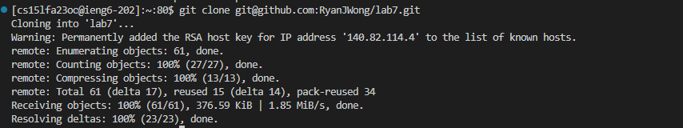

# Lab Report 4 - Ryan Wong
## Step 4 - Logging in to ieng6 

Keys pressed: ssh
``` bash
<ctrl-v><enter>
```
The cs15lfa23oo@ieng6-202 string was in my clipboard so I pasted it to make entering easier. I then entered the command to log into my account.

## Step 5 - Cloning git repo

Keys pressed: git clone
``` bash
<ctrl-c><ctrl-v><enter>
```
The git@github.com:RyanJWong/lab7.git ssh string was copied to my clipboard using ctrl-c then pasted into my terminal, I then entered the command to clone my repository.

## Step 6 - Run failing tests

Keys pressed: cd lab7
``` bash
<enter>, <up><up><up><enter>, <up><up><up><enter>
```
bash test.sh 
``` bash
<enter>
```
I entered cd lab7 to enter my cloned repo's directory, then pressed the up arrow 3 times as the javac -cp .:lib/hamcrest-core-1.3.jar:lib/junit-4.13.2.jar *.java was 3 up in my search history, so I used the arrow to access it. Then the java -cp .:lib/hamcrest-core-1.3.jar:lib/junit-4.13.2.jar org.junit.runner.JUnitCore command was 2 up in my history, so I used the same method, but had to press 3 times now as the previous command shifted it up once. I then entered the bash test.sh script to demonstrate that the tests failed.

## Step 7 - Fixing the code

Keys pressed: vim ListExamples.java
``` bash
<enter>, <shift+g>, <up><up><up><up><up><up>, <e>, <r>
```
2
``` bash
<esc>, <:wq>, <enter>
```
I entered vim using the first command, then went to the end of file using shift+g, I then pressed the up arrow 6 times as index1 was 6 up from the end of file, I then pressed e to get to the end of the word index1, I then pressed r to replace the 1 with a 2 and then esc to enter normal mode and save and exit.

## Step 8 - Run successful tests

Keys pressed:
```bash
<up><up><up><up><up><up><up><up>, <enter>, <up><up><up><up><up><up><up><up>, <enter>
```
bash test.sh
```bash
<enter>
```
I pressed the up arrow 8 times as javac -cp .:lib/hamcrest-core-1.3.jar:lib/junit-4.13.2.jar *.java was 8 up in my bash history. So I pressed up 8 times and executed it. Then the java -cp .:lib/hamcrest-core-1.3.jar:lib/junit-4.13.2.jar org.junit.runner.JUnitCore command was 7 up in my history, so I used the same method, but had to press 8 times now as the previous command shifted it up once. I then entered the bash test.sh script to demonstrate that the tests ran successfully now.

## Step 9 - Committing and pushing changes

Keys pressed: git add --all
```bash
<enter>
```

git commit -m "Fixes"
```bash
<enter>
```
git push
```bash
<enter>
```
I entered each git command, first adding my changes to be committed, then committed, and finally pushed my changes to my repository!
