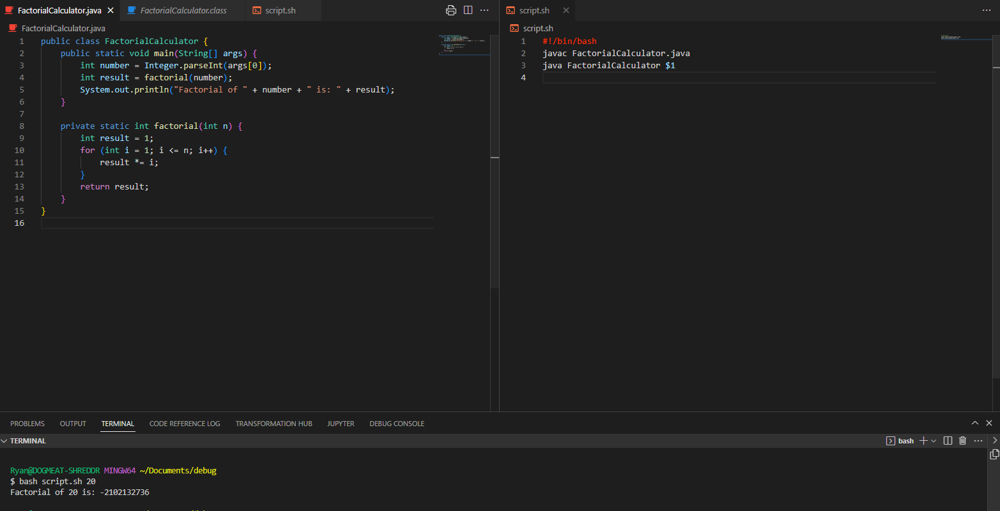
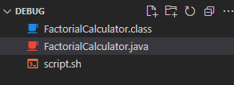
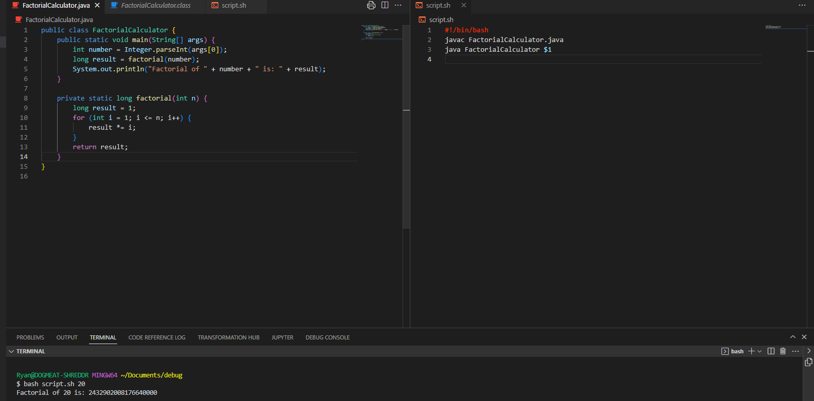

# Lab Report 5 - Ryan Wong
## Part 1 – Debugging Scenario
### Student:
"Help my code for calculating factorials gives me the incorrect result. I have a bash script called 'script.sh' to run my java program, when I run 'bash script.sh 20' to calculate 20!, I get -2102132736 which is clearly incorrect! I need help!"

"This is my current structure:"

### TA:
"Hi! Happy to help, have you considered that your code is unable to store large numbers, resulting in overflow? Have you tried using a different data type other than int?"

### Student:
"Oh! That definitely seems like it would help, I'm going to store my value as a long instead and see if overflow persists!"

"I see now! There was definitely overflow going on, the size of the factorial exceeded the integer's max value, resulting in my overflow, using a long will increase my maximum value for factorials now! Thank you."
"To fix the bug I changed the result variable to be stored as a long and the return type of my factorial function to be long as well"

## Part 2 – Reflection
This second half of the quarter I learned how to do bash scripting at a much higher level. I have used bash before but at a very rudimentary level. Being able to learn in depth about commands as well as their use cases has been very beneficial. I have been shown the versatility and power of these scripts and my skills overall have greatly improved because of them.